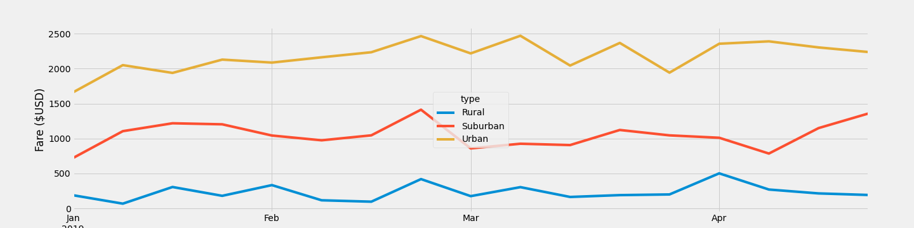

# PyBer_Analysis

<h1>Project Overview</h1>
We have been hired by PyBer, a ride sharing app company to analyze all the rideshare data from January to early may of 2019. More specificly we are looking for statistics on city type, number of rides, and fare averages.

<h1>Resources</h1>

- Data Sources: city_data.csv, ride_data.csv

- Software: Python 3.9, Jupyter Notebook

<h1>Summary</h1>
<h4>The analysis of the ride data shows:</h4>

-There were "2,375" rides across city types.

<h4>The city specific rides are:</h4>

- Rural: 125
- Suburban: 625
- Urban: 1,625

<h4>The Average Fare per Ride:</h4>

- Rural: $34.62
- Suburban: $30.97
- Urban: $24.53

<h4>The Average Fare per Driver:</h4>

- Rural: $55.49
- Suburban: $39.50
- Urban: $16.57

<h1>Challange Summary</h1>

We have cleaned the data so we could provide detailed numbers and statistics for multiple data points, simplifying the data into easy to read DataFrames and plots.

The drivers working in the Rural areas have fewer rides but the average fare per driver is much higher than the averages for Suburban and Urban areas. Then on the other side of the story the number of rides in the Urban areas are far higher than the other city types making the earning potential higher. 

Key take aways: 
  
- For drivers working in the Rural areas, it may be more difficult to find drivers to work consistently with the much lower number of rides and therefor income. 

- The higher price for the customer in Rural areas is also a concern.

- The much larger number of rides completed in Urban areas will require a higher volume of drivers to support the demand

- You could gather more specific data on the time of day rides are completed, to make better decisions on pricing, and the needed location of drivers. 
